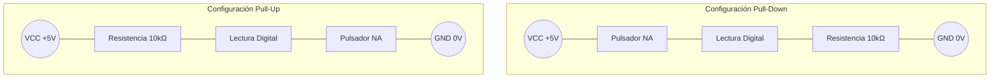

# 🔘 Pulsadores e Interruptores

Los pulsadores e interruptores son los dispositivos mecánicos de entrada más fundamentales en la electrónica. Sirven como el puente entre una acción física del usuario (o máquina) y una **magnitud digital** interpretada por un circuito.

## 1. El Interruptor (Switch)
Es un dispositivo mecánico diseñado para desviar o interrumpir el paso de corriente eléctrica. 
* **Memoria mecánica:** Mantiene su estado después de ser accionado. Si lo enciendes, se queda encendido hasta que lo apagas manualmente.
* **Ejemplo clásico:** El interruptor de la luz de un cuarto.

### Tipos Comunes (Nomenclatura)
1. **SPST (Single Pole, Single Throw):** Un polo, un tiro. Es el más simple (Encendido / Apagado).
2. **SPDT (Single Pole, Double Throw):** Un polo, doble tiro. Permite dirigir la corriente por dos caminos diferentes.

## 2. El Pulsador (Push-button)
A diferencia del interruptor, el pulsador tiene un resorte interno. **No guarda memoria mecánica** de su estado.
* **Operación temporal:** Solo cambia su estado eléctrico *mientras* está siendo presionado físicamente.

### Configuraciones del Pulsador
* **NA (Normalmente Abierto / NO - Normally Open):** El circuito está desconectado. Al presionar, el circuito se cierra (pasa la corriente).
* **NC (Normalmente Cerrado / NC - Normally Closed):** El circuito fluye de forma natural. Al presionar, el circuito se interrumpe (corta la corriente).

---

## ⚡ ¿Cómo los lee una computadora digital? (Resistencias Pull-up / Pull-down)

Si conectas un pulsador directamente a un pin de lectura de un microcontrolador (o compuerta lógica), ocurre un problema: cuando el botón no está presionado, el pin queda "flotando" en el aire. Actúa como una antena y lee estados de `0` o `1` de manera aleatoria.

Para evitar esto, fijamos un estado lógico seguro usando **resistencias**.

| Configuración | Estado en Reposo (Sin pulsar) | Estado al Presionar | Uso Común                                   |
| :------------ | :---------------------------: | :-----------------: | :------------------------------------------ |
| **Pull-Down** |       Lee un `0` (GND)        |  Lee un `1` (+5V)   | Circuitos didácticos e industriales         |
| **Pull-Up**   |       Lee un `1` (+5V)        |  Lee un `0` (GND)   | Microcontroladores (tienen Pull-up interno) |

> [!WARNING] Cuidado con los Cortocircuitos
> Si no se coloca la resistencia `Pull-up` o `Pull-down` y se presiona el botón, VCC se conecta directamente con GND y se genera un cortocircuito que puede dañar la fuente de poder.

---
**Contexto:**
* Relacionado con: [[magnitudes-analogicas-y-digitales|Magnitudes Digitales]] y el curso de [[wiki/cursos/electronica-para-computacion|Electrónica para Computación]].
