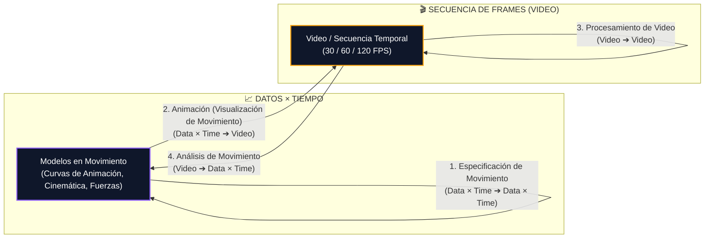

# ⏱️ Computación Gráfica en Movimiento (*Motion, Animation & Video*)

> **Sección del Libro**: *Computer Graphics: Theory and Practice* (Gomes, Velho & Costa), Capítulo 1, **Sección 1.1.1: Motion** (Págs. 3–4).

---

## 🎯 1. La Inclusión de la Dimensión Temporal ($t$)

Al añadir el **tiempo** como variable fundamental, las subdisciplinas estáticas de la computación gráfica se expanden al dominio dinámico. Los datos geométricos se convierten en **trayectorias temporales** y las imágenes fijas se transforman en **secuencias ordenadas de cuadros (*frames / video*)**:

$$\LARGE \text{Datos} \times \text{Tiempo} \longleftrightarrow \text{Secuencia de Cuadros (Video)}$$

---

## 🧭 2. Las Cuatro Subdisciplinas Temporales

| Subdisciplina Temporal | Entrada | Salida | Equivalente Estático | Definición y Propósito |
| :--- | :---: | :---: | :--- | :--- |
| **1. Especificación de Movimiento** (*Motion Specification / Modeling*) | **Datos $\times t$** | **Datos $\times t$** | Modelado Geométrico | Modela y describe matemáticamente el comportamiento de objetos dinámicos: trayectorias, cinemática directa/inversa de esqueletos, simulación física de fluidos/telas y deformaciones. |
| **2. Animación / Visualización de Movimiento** (*Animation*) | **Datos $\times t$** | **Video** | Renderizado / Síntesis | Traduce la descripción del objeto y la escena en el tiempo hacia una secuencia continua de imágenes (*frames*) renderizadas a alta velocidad (24, 30 o 60 FPS). |
| **3. Procesamiento de Video** (*Video Processing*) | **Video** | **Video** | Procesamiento de Imágenes | Manipulación, filtrado temporal, estabilización, corrección de color y compresión de secuencias de video (codecs MPEG, H.264, HEVC, AV1). |
| **4. Análisis de Movimiento** (*Motion Analysis*) | **Video** | **Datos $\times t$** | Visión por Computadora | Obtiene información sobre una escena dinámica a partir del video: estimación de flujo óptico, seguimiento de objetos (*tracking*) y captura de movimiento (*MoCap*). |

---

## 🎮 3. Aplicaciones en la Industria
* **Cine y Videojuegos**: Simulación física en tiempo real de cuerpos rígidos, ropa y cabello.
* **Captura de Movimiento (*MoCap*)**: Registro de actores con marcadores ópticos para transferir su movimiento a personajes 3D.
* **Compresión de Video**: Detección de redundancia temporal entre fotogramas sucesivos para transmitir video por internet con bajo ancho de banda.

---

## 🔗 Enlaces Relacionados en la Bóveda
- [[transformacion-datos-a-imagenes|La Transformación Fundamental: Datos a Imágenes]]
- [[modelado-geometrico|Modelado Geométrico]]
- [[renderizado-sintesis-de-imagen|Renderizado y Síntesis de Imagen]]
- [[objeto-grafico|El Concepto de Objeto Gráfico]]
- [[wiki/cursos/computacion-grafica|Hub de Asignatura: Computación Gráfica]]
