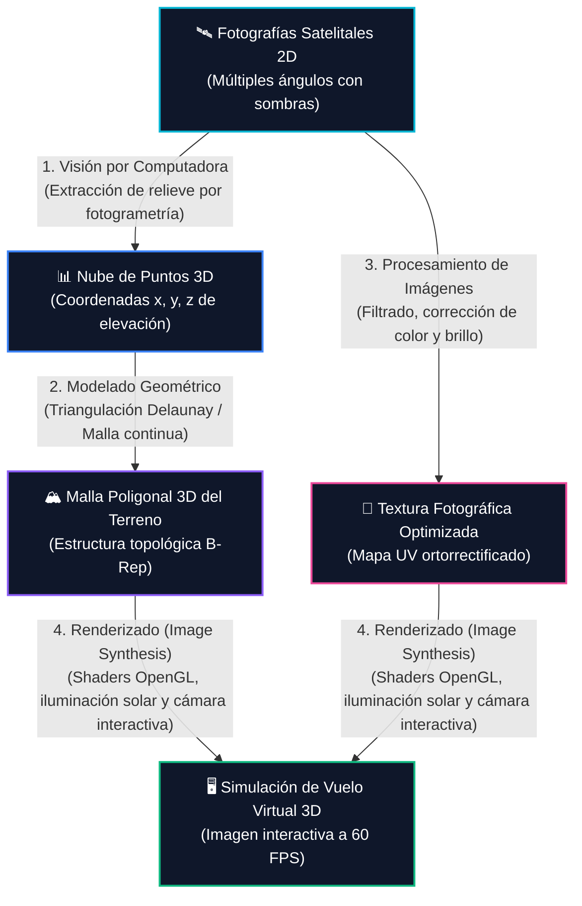

# 🌐 Integración Multidisciplinar en Computación Gráfica

> **Sección del Libro**: *Computer Graphics: Theory and Practice* (Gomes, Velho & Costa), Capítulo 1, **Sección 1.1.3: What This Book Covers** (Págs. 4).

---

## 🎯 1. Principio de Acción Unificada

Aunque la teoría divide la computación gráfica en **Modelado**, **Renderizado**, **Procesamiento de Imágenes** y **Visión por Computadora** para facilitar su estudio riguroso, **la inmensa mayoría de aplicaciones reales exige que varias o todas estas subdisciplinas actúen de manera simultánea e integrada**.

El uso combinado de estas técnicas es precisamente lo que otorga a la computación gráfica su inmenso poder tecnológico y científico.

---

## 🛰️ 2. Caso de Estudio: Reconstrucción y Visualización de Terrenos Satelitales

En este flujo real, las cuatro subdisciplinas interactúan en un ciclo cerrado de retroalimentación:

1. **Visión por Computadora**: Analiza las imágenes satelitales 2D y extrae la profundidad y relieve mediante correspondencia estéreo y fotogrametría ($\text{Imagen} \to \text{Datos}$).
2. **Modelado Geométrico**: Convierte la nube de puntos dispersos en una malla continua de triángulos conectada topológicamente ($\text{Datos} \to \text{Datos}$).
3. **Procesamiento de Imágenes**: Elimina sombras indeseadas, equilibra el contraste y genera mapas de textura corregidos ($\text{Imagen} \to \text{Imagen}$).
4. **Renderizado**: Aplica la textura sobre la malla 3D, simula la posición del sol con modelos de iluminación y proyecta el terreno sobre una cámara virtual interactiva ($\text{Datos} \to \text{Imagen}$).

---

## 🏥 3. Caso de Estudio: Medicina Computacional (Tomografía / Cirugía Guiada)
* **Procesamiento de Imágenes**: Filtra el ruido en los cortes axiales 2D de una Tomografía Computarizada (TAC) o Resonancia Magnética (RMN).
* **Visión por Computadora**: Segmenta y reconoce órganos, huesos o tumores de forma automática.
* **Modelado Geométrico**: Genera mallas poligonales 3D de los órganos detectados (algoritmo *Marching Cubes*).
* **Renderizado**: Proyecta la anatomía del paciente en 3D en tiempo real para planificar cirugías complejas.

---

## 📚 4. Alcance Temático del Libro de Gomes & Velho
El texto se enfoca primordialmente en:
* Fundamentos de **Modelado Geométrico** y **Procesamiento de Imágenes**.
* Tratamiento matemático profundo de **Renderizado y visualización de superficies 3D**.
* Introducción a la **animación jerárquica** y parametrización de **movimientos rígidos en el espacio euclidiano $\mathbb{R}^3$**.

---

## 🔗 Enlaces Relacionados en la Bóveda
- [[transformacion-datos-a-imagenes|La Transformación Fundamental: Datos a Imágenes]]
- [[modelado-geometrico|Modelado Geométrico]]
- [[renderizado-sintesis-de-imagen|Renderizado y Síntesis de Imagen]]
- [[procesamiento-de-imagenes|Procesamiento de Imágenes]]
- [[vision-por-computadora|Visión por Computadora]]
- [[objeto-grafico|El Concepto de Objeto Gráfico]]
- [[wiki/cursos/computacion-grafica|Hub de Asignatura: Computación Gráfica]]
