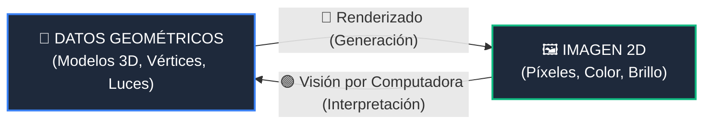

# 🔶 Renderizado y Síntesis de Imagen (*Rendering*)

> **Sección del Libro**: *Computer Graphics: Theory and Practice* (Gomes, Velho & Costa), Capítulo 1, **Sección 1.1: Data, Images, and Computer Graphics** (Págs. 1–2).

---

## 🎯 1. Definición y Clasificación Entrada/Salida

El **Renderizado** (o *Síntesis de Imagen*) es la subdisciplina encargada de **procesar los datos generados por un sistema de modelado geométrico para producir una imagen** visualizable en un dispositivo gráfico.

$$\LARGE \text{Datos} \xrightarrow{\quad\text{Renderizado / Síntesis}\quad} \text{Imágenes}$$

```
   [ Malla 3D, Luces, Cámara ] ──► [ Pipeline Gráfico / GPU ] ──► [ 🖼️ Cuadro de Píxeles RGB ]
             (Datos)                                                          (Imagen)
```

* **Entrada**: Datos abstractos del mundo virtual (vértices 3D, propiedades de materiales, fuentes de luz, parámetros de cámara virtual).
* **Salida**: Imagen 2D (matriz de píxeles con canales de color RGB o RGBA).

---

## ⚙️ 2. Procesos Centrales del Renderizado

Para transformar geometría 3D en píxeles 2D, el renderizado combina simulaciones físicas y proyecciones geométricas:

1. **Cámara Virtual y Proyecciones**: Proyectar coordenadas del espacio tridimensional $\mathbb{R}^3$ sobre el plano de proyección bidimensional de la pantalla (proyección ortográfica o perspectiva).
2. **Determinación de Superficies Visibles (Oclusión)**: Resolver qué partes de los objetos están tapadas y no deben verse (algoritmo del *Z-Buffer* o trazado de rayos).
3. **Modelos de Iluminación y Sombreado**: Calcular la interacción de la luz con las superficies (reflexión ambiental, difusa de Lambert, especular de Phong).
4. **Rasterización**: Convertir primitivas continuas (triángulos, líneas) en fragmentos discretos de píxeles en el framebuffer.

---

## ⚖️ 3. La Dualidad Inversa con la Visión por Computadora



* El **Renderizado** es un proceso **hacia adelante (síntesis)**: sabe todo sobre el mundo 3D y genera la imagen proyectada.
* La **Visión por Computadora** es el proceso **inverso (análisis)**: solo tiene la imagen proyectada y debe deducir cómo es el mundo 3D que la produjo.

---

## 🔗 Enlaces Relacionados en la Bóveda
- [[transformacion-datos-a-imagenes|La Transformación Fundamental: Datos a Imágenes]]
- [[modelado-geometrico|Modelado Geométrico]] ($\text{Datos} \to \text{Datos}$)
- [[vision-por-computadora|Visión por Computadora]] ($\text{Imágenes} \to \text{Datos}$)
- [[procesamiento-de-imagenes|Procesamiento de Imágenes]] ($\text{Imágenes} \to \text{Imágenes}$)
- [[wiki/cursos/computacion-grafica|Hub de Asignatura: Computación Gráfica]]
