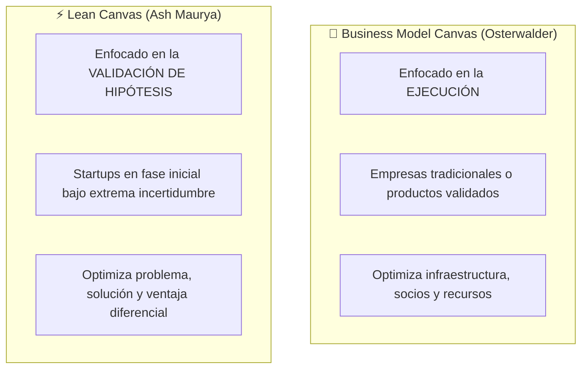
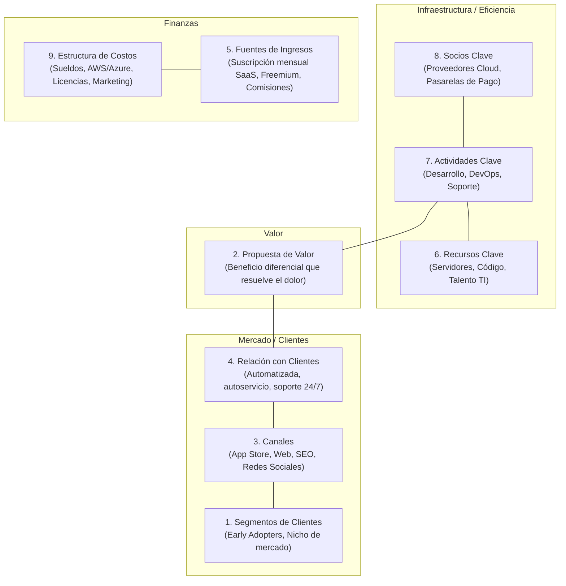
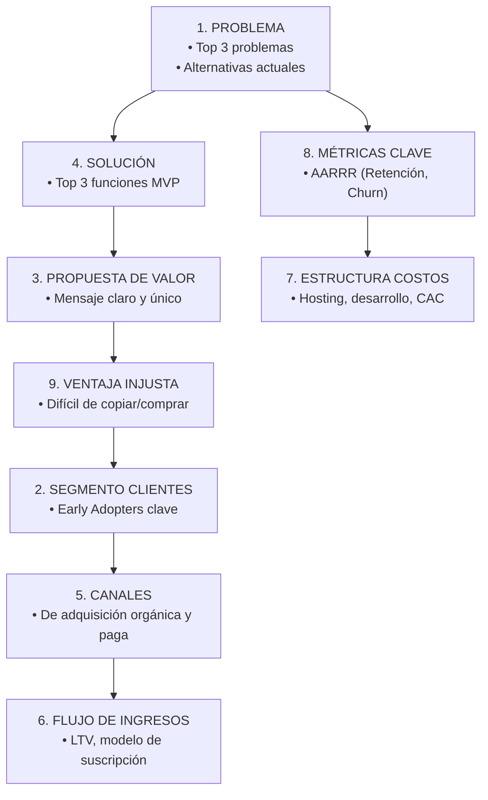

# 📊 Modelos de Negocio: Business Model Canvas vs. Lean Canvas

Un **modelo de negocio** describe la lógica de cómo una organización crea, entrega y captura valor. En el desarrollo de software existen dos herramientas visuales estándar de una sola página: el **Business Model Canvas (BMC)** de Alexander Osterwalder y el **Lean Canvas** de Ash Maurya.

---

## 1. Comparativa Estructural: ¿Cuándo usar cuál?

---

## 2. Los 9 Bloques del Business Model Canvas (Osterwalder)

El lienzo tradicional organiza el negocio en dos hemisferios: el hemisferio derecho (el mercado y el valor) y el hemisferio izquierdo (la infraestructura y los costos).

---

## 3. La Evolución al Lean Canvas (Específico para Startups)

Ash Maurya modificó 4 bloques de Osterwalder porque en una startup temprana los "Socios" y los "Recursos" aún no existen o son irrelevantes frente al riesgo de no resolver un problema real:

| Bloque en BMC tradicional | Bloque Reemplazado en Lean Canvas | ¿Por qué el cambio en Startups? |
| :--- | :--- | :--- |
| **Socios Clave** | 🚨 **Problema** (Top 3 dolores) | En etapa temprana, tener socios no sirve de nada si no sabes qué problema resuelves. Incluye *Alternativas Existentes*. |
| **Actividades Clave** | 💡 **Solución** (Top 3 características) | La solución debe ser ligera y describir las 3 funciones mínimas viables del MVP. |
| **Recursos Clave** | 📈 **Métricas Clave** (Pirate Metrics AARRR) | Se deben medir métricas de comportamiento: Adquisición, Activación, Retención, Ingresos, Recomendación. |
| **Relación con Clientes** | 🛡️ **Ventaja Injusta (Unfair Advantage)** | Algo que no se pueda copiar ni comprar fácilmente (efectos de red, patentes, algoritmo propietario, comunidad leal). |

---

## 4. Métricas Clave para Startups de Software (Pirate Metrics - AARRR)

Al redactar el bloque de métricas clave en el Lean Canvas, los proyectos de software deben definir:

1. **Adquisición (Acquisition):** ¿Cuántos usuarios descargan la app o visitan la landing page?
2. **Activación (Activation):** ¿Cuántos completan el registro y experimentan el *"Momento Ajá"* (primer uso exitoso)?
3. **Retención (Retention):** ¿Cuántos regresan al día 7 y al día 30? (Métrica reina del Product-Market Fit).
4. **Ingresos (Revenue):** ¿Cuántos se convierten a usuarios de pago? (MRR - Monthly Recurring Revenue).
5. **Referencia (Referral):** ¿Cuántos invitan a amigos o recomiendan el sistema? (K-Factor de viralidad).

---

> [!TIP] Clave para el Trabajo Final del Curso (Semanas 11-15)
> Para la entrega final y el Pitch, el profesorado de la UNT solicita:
> 1. Un **Lean Canvas** validado con evidencias de campo.
> 2. Una demostración del MVP funcionando.
> 3. La justificación de la **Ventaja Injusta** y la estructura de costos frente a los ingresos esperados.

---
**Fuentes y Referencias:**
* 📄 UNT: *1. TALLER 2 - DESIGN THINKING Y LEAN CANVAS (1).pdf*.
* 📄 UNT: *5. Manual-Lean-Startup.pdf*.
* 📚 Osterwalder, A. & Pigneur, Y. — *Business Model Generation* (2010).
* 📚 Maurya, Ash — *Running Lean: Iterate from Plan A to a Plan That Works* (2012).
* 🔗 Relacionado con: [[perfiles-emprendedores-y-startups|Perfiles Emprendedores y Startups]] | [[design-thinking-metodologia|Design Thinking]] | [[elevator-pitch|Elevator Pitch]]
