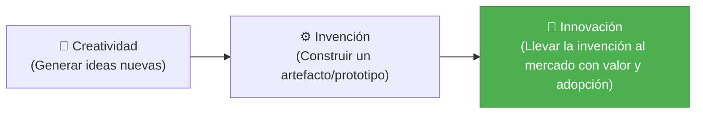
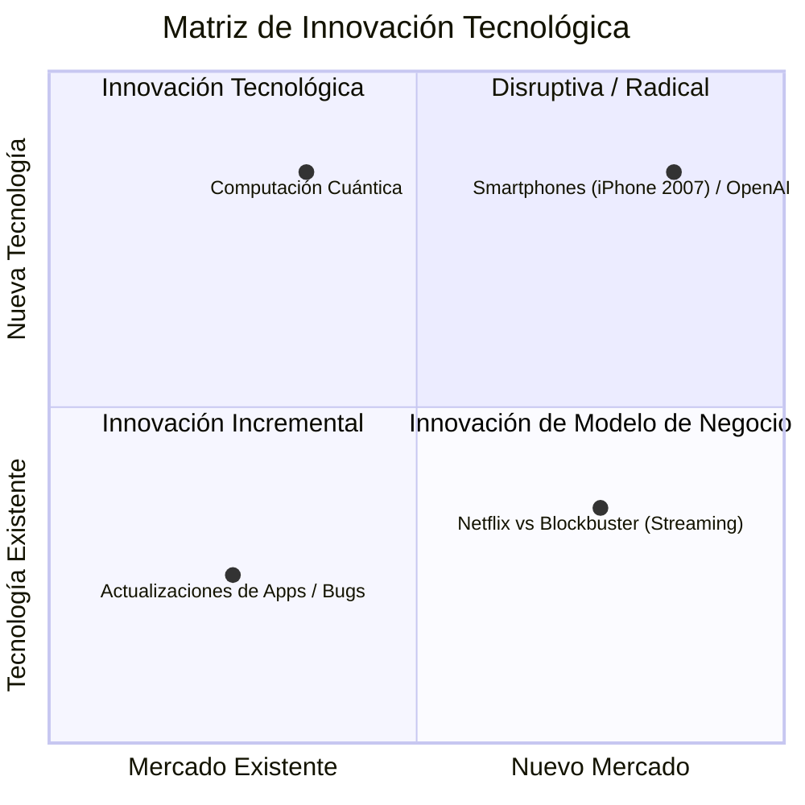
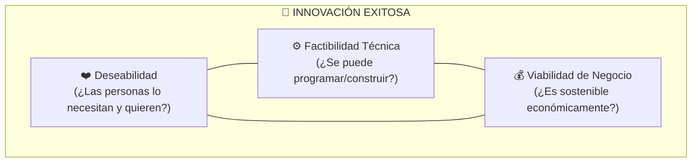

# 💡 Creatividad, Invención e Innovación Tecnológica

En el desarrollo de software y negocios de base tecnológica, es fundamental distinguir la diferencia entre **tener una idea**, **construir un artefacto** y **generar valor medible en el mercado**.

---

## 1. La Ecuación Fundamental de la Innovación

> [!quote] Definición Académica (UNT - Sesión 1)
> *"La creatividad es pensar cosas nuevas. La innovación es hacer cosas nuevas que aporten valor y sean adoptadas por las personas y el mercado."*
> $$\text{Innovación} = \text{Idea Creativa} + \text{Ejecución Técnica} + \text{Aceptación de Mercado (Valor)}$$

| Concepto | Pregunta Clave | Salida / Output | Ejemplo en Computación |
| :--- | :--- | :--- | :--- |
| **Creatividad** | *¿Qué pasaría si...?* | Conceptos, bocetos, hipótesis | Idear un sistema donde no existan contraseñas. |
| **Invención** | *¿Cómo se construye técnicamente?* | Prototipos, patentes, código funcional | Desarrollar un lector biométrico o protocolo de autenticación criptográfica. |
| **Innovación** | *¿Quién lo usa y paga por ello?* | Producto en el mercado, modelo de negocio viable | **Passkeys / Apple FaceID**: Millones de usuarios autenticándose sin claves a diario. |

---

## 2. Tipos de Innovación (Matriz de Impacto)

La innovación no siempre requiere reinventar la rueda; varía según el grado de novedad tecnológica y de mercado:

### A. Innovación Incremental
* **Enfoque:** Mejoras continuas sobre productos o servicios que ya existen.
* **Riesgo:** Bajo.
* **Ejemplo:** Actualización de una app añadiendo modo oscuro o aumentando la velocidad de renderizado en un 15%.

### B. Innovación Radical
* **Enfoque:** Combina una tecnología totalmente nueva para resolver un problema de una manera que antes era imposible.
* **Riesgo:** Alto, pero crea mercados gigantescos.
* **Ejemplo:** La invención de la base de datos relacional (SQL) frente a los archivos secuenciales planos.

### C. Innovación Disruptiva (Clayton Christensen)
* **Enfoque:** Entra por la parte baja del mercado con una solución más simple, barata o accesible, desplazando con el tiempo a los líderes de la industria.
* **Ejemplo:** **Canva** frente a software profesional complejo como Photoshop/Illustrator para diseño rápido.

---

## 3. El Triángulo de Viabilidad en Innovación (Design Thinking Focus)

Para que una propuesta tecnológica prospere, debe ubicarse en la intersección de tres fuerzas:

1. **Deseabilidad (Humano):** Resuelve un dolor real (dolor de cabeza vs vitamina).
2. **Factibilidad (Tecnología):** Contamos con la infraestructura, algoritmos y hardware para construirlo.
3. **Viabilidad (Negocio):** El costo de adquisición del cliente ($CAC$) es menor que el valor de vida del cliente ($LTV$).

---

> [!TIP] Clave para Exámenes y Proyectos
> En el curso de la UNT, los proyectos de software no deben justificarse diciendo *"usamos tecnología moderna (React, Flutter, IA)"*, sino explicando **cuál es el dolor específico del usuario** que dicha tecnología resuelve mejor que las alternativas existentes.

---
**Fuentes y Referencias:**
* 📄 UNT: *13640 [Semana-01] Innovación y Emprendimiento - Clase.pdf*.
* 📚 Christensen, C. — *The Innovator's Dilemma*.
* 🔗 Relacionado con: [[perfiles-emprendedores-y-startups|Perfiles Emprendedores y Startups]] | [[design-thinking-metodologia|Design Thinking]] | [[innovacion-y-emprendimiento|Hub de Innovación]]
