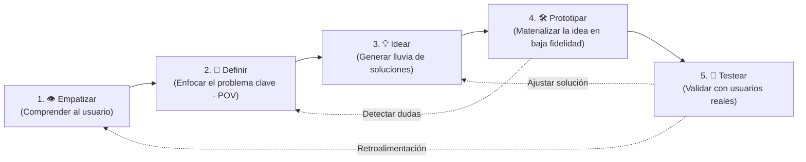
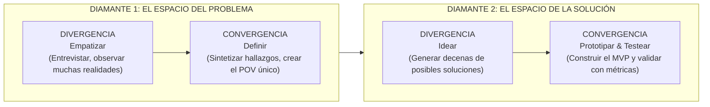
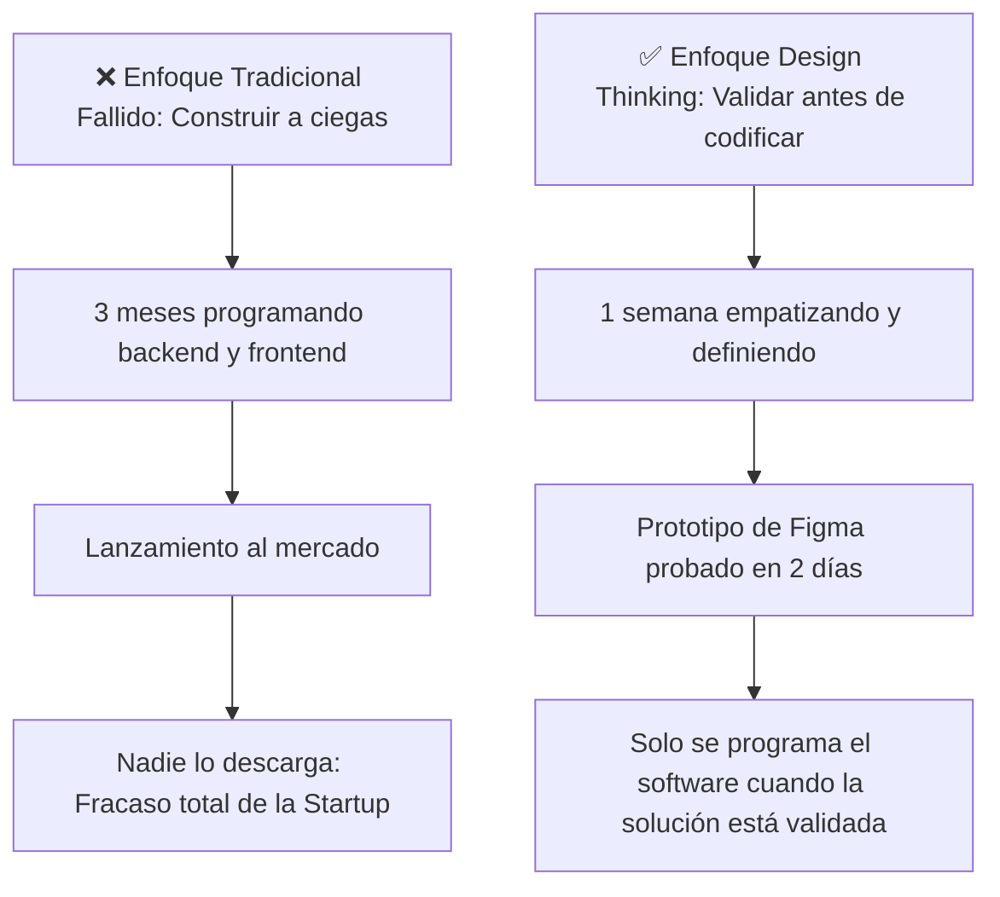

# 🎨 Metodología Design Thinking: Innovación Centrada en las Personas

El **Design Thinking** (popularizado por IDEO y la d.school de Stanford University) es una metodología de resolución de problemas complejos enfocada en entender profundamente las necesidades de los usuarios para crear soluciones tecnológicas deseables, factibles y viables.

---

## 1. El Modelo del Doble Diamante (Divergencia y Convergencia)

El proceso de diseño no es lineal, sino una alternancia constante entre **abrir la mente a múltiples opciones** (Divergir) y **seleccionar la mejor opción** (Converger):

1. **Diamante del Problema:** ¿Estamos resolviendo el problema correcto? (Construir la cosa correcta).
2. **Diamante de la Solución:** ¿Estamos diseñando la solución correcta? (Construir la cosa correctamente).

---

## 2. Las 5 Fases del Proceso Explicadas

| Fase | Objetivo Principal | Herramientas Clave | Salida / Artefacto |
| :---: | :--- | :--- | :--- |
| **1. Empatizar** | Ponerse en los zapatos del usuario y entender sus frustraciones sin juzgar. | Entrevistas en profundidad, Observación directa (Shadowing). | Transcripciones, citas textuales, historias de vida. |
| **2. Definir** | Transformar el caos de datos recopilados en un foco de diseño accionable. | Mapa de Empatía, Arquetipo/Buyer Persona, Matriz de Hallazgos. | **Point of View (POV)** y Pregunta disparadora **HMW**. |
| **3. Idear** | Generar la mayor cantidad de ideas posibles sin censura previa. | Brainstorming, SCAMPER, Crazy Eights, Co-diseño. | Lista priorizada de funcionalidades y conceptos de solución. |
| **4. Prototipar** | Hacer tangibles las ideas para que el usuario pueda interactuar con ellas. | Wireframes en papel, maquetas en Figma, mockups interactivos sin backend. | Prototipo de baja / media fidelidad (Clickable Prototype). |
| **5. Testear** | Poner el prototipo frente a usuarios reales y escuchar sus reacciones. | Malla receptora de información, pruebas de usabilidad, métricas de éxito. | Decisiones de iteración: Mejorar, Perseverar o Pivotar. |

---

## 3. ¿Por qué es Vital para Ingenieros Informáticos?

Los programadores suelen cometer el error de empezar abriendo el editor de código (**VS Code**) antes de entender qué necesita el cliente:

---

> [!NOTE] Unidad II del Curso UNT
> En la Universidad Nacional de Trujillo, las semanas 6 a 10 están dedicadas a recorrer rigurosamente este ciclo sobre un proyecto real enfocado en el ecosistema regional (empresas locales, salud o educación).

---
**Fuentes y Referencias:**
* 📄 UNT: *1. TALLER 2 - DESIGN THINKING Y LEAN CANVAS (1).pdf*.
* 📄 UNT: *3. GUÍA DESIGN THINKING V 1.2 JMV_compressed.pdf*.
* 📚 Brown, Tim — *Change by Design: How Design Thinking Transforms Organizations* (IDEO).
* 🔗 Relacionado con: [[fase-empatizar-y-mapa-de-empatia|Fase 1: Empatizar]] | [[fase-definir-pov-y-hmw|Fase 2: Definir]] | [[scrum-para-startups|Scrum para Startups]]
