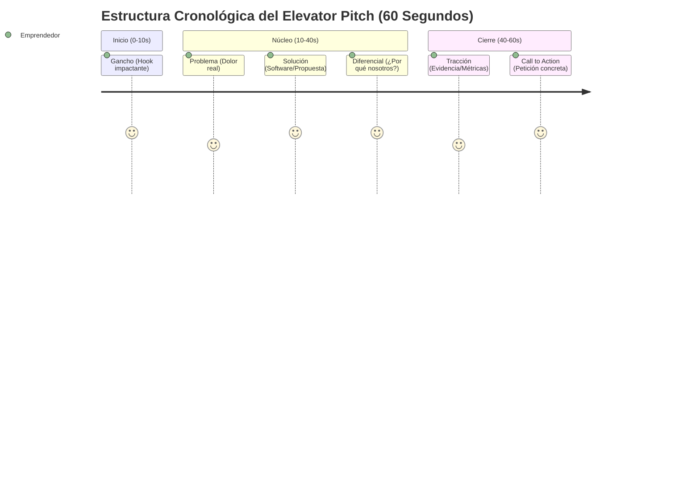
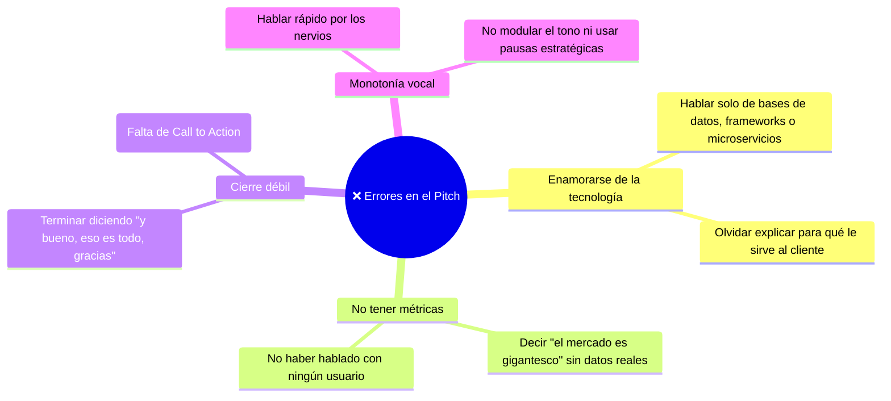

# 🎙️ Elevator Pitch: Estructura y Comunicación Persuasiva

Un **Elevator Pitch** es una presentación breve, clara y persuasiva de una idea de negocio o proyecto tecnológico, diseñada para captar el interés de un inversor, cliente o jurado en el tiempo que dura un viaje en ascensor (**entre 30 y 90 segundos**).

---

## 1. La Estructura de 6 Pasos (Estándar UNT)

De acuerdo a la *Sesión 04* y la rúbrica de evaluación del *Examen de Unidad I*, un pitch tecnológico ganador debe contener obligatoriamente estos 6 elementos:

| Paso | Elemento | Duración sugerida | Pregunta a responder | Objetivo |
| :---: | :--- | :---: | :--- | :--- |
| **1** | **El Gancho (Hook)** | 5 - 10 seg | *¿Sabías que...? / Imagina que...* | Romper la apatía y captar la atención inmediata con un dato alarmante o una vivencia cercana. |
| **2** | **El Problema** | 10 - 15 seg | *¿A quién le duele y cuánto le cuesta?* | Describir con empatía el dolor del usuario. No hablar de tecnología aún, sino del sufrimiento del cliente. |
| **3** | **La Solución** | 10 - 15 seg | *¿Qué hace tu producto de software?* | Presentar tu propuesta de valor en una frase comprensible para cualquier persona sin tecnicismos oscuros. |
| **4** | **El Diferencial** | 10 - 15 seg | *¿Por qué ustedes y no la competencia?* | Destacar tu ventaja competitiva (10x más rápido, automatizado con IA, 80% más económico, offline). |
| **5** | **La Tracción / Validación** | 5 - 10 seg | *¿Qué pruebas tienes de que funciona?* | Mostrar números: prototipo funcional, 50 usuarios encuestados, 3 cartas de intención de empresas locales. |
| **6** | **Llamado a la Acción (CTA)** | 5 - 10 seg | *¿Qué necesitas exactamente hoy?* | Pedir algo específico: *"Queremos 15 minutos el martes para mostrarles la demo"* o *"Buscamos $10k para servidores"*. |

---

## 2. Plantilla Práctica de Redacción (Mad Libs Format)

Para redactar el pitch antes de exponerlo, los equipos de informática utilizan este formato de síntesis:

> **[Gancho]:** ¿Sabías que el 70% de las microempresas en Trujillo pierden hasta 4 horas al día gestionando sus inventarios en papel?  
> **[Problema]:** Esto provoca quiebres de stock, pérdidas económicas y clientes frustrados que se van a la competencia.  
> **[Solución]:** Para resolverlo creamos **StockFast**, una plataforma web y móvil que sincroniza las ventas en tiempo real mediante escaneo con la cámara del celular.  
> **[Diferencial]:** A diferencia de los costosos sistemas ERP tradicionales, StockFast funciona 100% offline y se configura en menos de 5 minutos sin necesidad de un técnico.  
> **[Tracción]:** Ya contamos con un prototipo funcional validado en 8 bodegas locales que redujeron sus pérdidas en un 40%.  
> **[Call to Action]:** Los invitamos a probar nuestra versión beta escaneando este código QR o agendando una reunión con nuestro equipo técnico.

---

## 3. Errores Fatales al Presentar un Pitch Tecnológico

---

> [!TIP] Rúbrica de Calificación Docente
> En las defensas de la UNT, los docentes evalúan con alta ponderación:
> 1. La seguridad y lenguaje corporal del expositor.
> 2. El respeto estricto del tiempo límite (no exceder el minuto).
> 3. La claridad con la que se demuestra que la idea resuelve un problema real del entorno local o nacional.

---
**Fuentes y Referencias:**
* 📄 UNT: *13640 [Semana-04] Innovación y Emprendimiento - Sesión 04: Scrum, Identificación de Ideas y Elevator Pitch.pdf*.
* 📄 UNT: *Guia_Practica_04_Seccion.docx (1).pdf* y *EXAMEN I UNIDAD SECCIÓN A.docx*.
* 📚 Kawasaki, Guy — *The Art of the Start 2.0* (Pitching).
* 🔗 Relacionado con: [[creatividad-e-innovacion|Creatividad e Innovación]] | [[metodologia-scamper|Método SCAMPER]] | [[fase-definir-pov-y-hmw|Fase Definir (POV y HMW)]]
