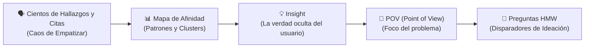
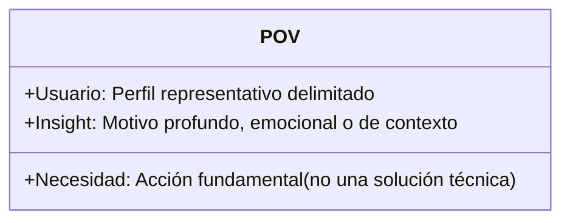
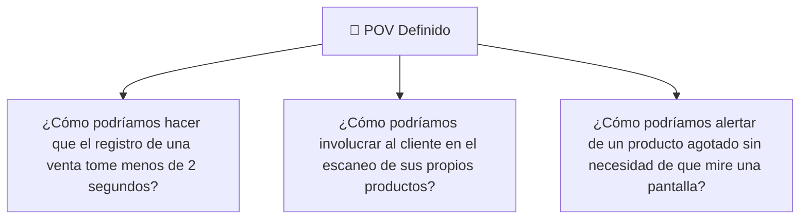

# 🎯 Fase 2 Design Thinking: Definir, POV y Preguntas HMW

La fase de **Definir** es el momento de **convergencia** donde el equipo toma toda la información desestructurada obtenida en las entrevistas y observaciones para destilarla en un **desafío de diseño claro, accionable y enfocado en el usuario**.

---

## 1. ¿Qué es un Insight (Revelación)?

Un **insight** no es un dato obvio ni una estadística; es una **comprensión profunda de por qué las personas hacen lo que hacen**.

* **Dato observable:** *"El 60% de los estudiantes no revisa el portal de la universidad en la noche."*
* **Interpretación superficial:** *"A los estudiantes no les interesa estudiar de noche."*
* **Insight real:** *"Los estudiantes no revisan el portal porque la interfaz móvil requiere descargar PDFs pesados y les consume sus datos móviles de recarga semanal."*

---

## 2. La Estructura Formal del Punto de Vista (POV)

En las evaluaciones de la UNT (Sesión 07), el POV se formula siguiendo una ecuación sintáctica estricta:

$$\text{POV} = \text{[Usuario Específico]} + \text{necesita [Necesidad (con verbo)]} + \text{porque [Insight / Revelación]}$$

### Reglas para formular un buen POV:
1. **La necesidad debe ser un VERBO, no un producto:**
   * ❌ *Mal:* "El bodeguero necesita **una app móvil en Flutter**..." *(Esto es una solución prematura, no una necesidad).*
   * ✅ *Bien:* "El bodeguero necesita **llevar el control de ventas sin interrumpir la atención al cliente**..."
2. **El Insight debe explicar la causa raíz:**
   * ✅ *Ejemplo Completo:* *"Carlos, dueño de un minimarket familiar, necesita **llevar el control diario de su stock sin interrumpir la atención al cliente**, porque **siente ansiedad de equivocarse al cobrar y teme que sus clientes piensen que es desorganizado**."*

---

## 3. Las Preguntas Disparadoras HMW (How Might We / ¿Cómo podríamos...?)

Una vez fijado el POV, se divide en preguntas **HMW** para abrir el espacio a la siguiente fase (**Idear**).

> [!TIP] El Arte de Formular HMW
> La pregunta debe ser lo suficientemente amplia como para permitir muchas ideas creativas, pero lo suficientemente acotada como para no perder el foco.

### Categorías de preguntas HMW:
* **Amplificar lo positivo:** ¿Cómo podríamos aprovechar que los clientes ya tienen celulares inteligentes?
* **Eliminar lo negativo:** ¿Cómo podríamos registrar ventas sin tocar un teclado?
* **Explorar lo opuesto:** ¿Cómo podríamos hacer que el inventario se actualice antes de que el cliente pague?

---

> [!IMPORTANT] Rúbrica de la UNT: Criterios de Aprobación
> Un POV aprobado en el curso debe demostrar:
> 1. Que no menciona tecnologías específicas en la necesidad (no decir "necesita React o IA").
> 2. Que el insight proviene de entrevistas reales registradas en la Semana 6.
> 3. Que genera al menos 3 preguntas HMW diferenciadas.

---
**Fuentes y Referencias:**
* 📄 UNT: *13640 [Semana-07] Innovación y Emprendimiento - Sesión 7: Design Thinking - Fase 2: Definir.pdf*.
* 📚 Dam, R. & Siang, T. — *Stage 2 in the Design Thinking Process: Define the Problem and Interpret the Results* (Interaction Design Foundation).
* 🔗 Relacionado con: [[fase-empatizar-y-mapa-de-empatia|Fase 1: Empatizar]] | [[design-thinking-metodologia|Design Thinking]] | [[metodologia-scamper|Método SCAMPER]]
