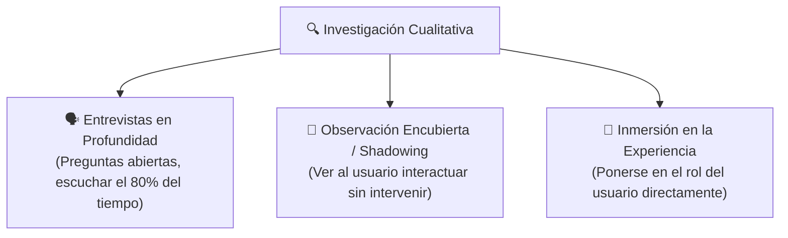
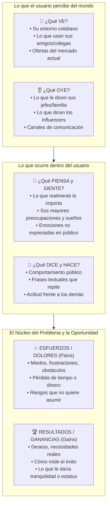

# 👁️ Fase 1 Design Thinking: Empatizar y el Mapa de Empatía

La fase de **Empatizar** es el punto de partida de cualquier proceso de innovación. Consiste en sumergirse en la realidad de los usuarios para comprender sus comportamientos, motivaciones, contextos y emociones subyacentes.

> [!quote] Regla de Oro (UNT - Sesión 6)
> *"No asumas lo que el usuario necesita; sal de la oficina y obsérvalo en su hábitat natural. Los usuarios rara vez hacen lo que dicen que hacen."*

---

## 1. Técnicas de Investigación Cualitativa



### Reglas para Entrevistas Efectivas
1. **Nunca hacer preguntas de Sí/No:** En vez de preguntar *¿Te gustaría una app de finanzas?*, preguntar: *¿Cómo llevas la cuenta de tus gastos al final del mes? Cuéntame la última vez que te faltó dinero.*
2. **Buscar la historia detrás del dolor:** Preguntar *"¿Por qué?"* hasta 5 veces para llegar a la raíz emocional.
3. **Identificar contradicciones:** Lo que la persona dice que le importa frente a lo que sus acciones demuestran.

---

## 2. El Mapa de Empatía (Empathy Map Canvas)

Es la herramienta visual estándar para sintetizar los hallazgos de las entrevistas en un perfil coherente:



---

## 3. Del Mapa de Empatía al Arquetipo de Usuario (User Persona)

Una vez completado el mapa, se consolida en una ficha de **User Persona** (arquetipo ficticio representativo del segmento):

```markdown
┌────────────────────────────────────────────────────────────────────────┐
│ 👤 USER PERSONA: "Carlos el Administrador Sobrecargado"                │
│                                                                        │
│ • Datos Demográficos: 38 años, administra un minimarket familiar.      │
│ • Frase Típica: "No puedo darme el lujo de cerrar para hacer inventario"│
│                                                                        │
│ • Motivaciones: Pasar más tiempo con sus hijos, hacer crecer el negocio│
│ • Frustraciones (Pains): Las hojas de Excel se corrompen, los empleados│
│   olvidan registrar productos, teme ser multado por desorden contable. │
│ • Dispositivos: Usa un smartphone Android gama media todo el día.       │
└────────────────────────────────────────────────────────────────────────┘
```

---

> [!IMPORTANT] Clave de Evaluación en la UNT
> En la *Guía de Práctica 06*, los docentes exigen que cada grupo adjunte **evidencia verificable de empatía**: fotografías de entrevistas, grabaciones breves o enlaces a formularios cualitativos con citas textuales de usuarios de Trujillo o su localidad.

---
**Fuentes y Referencias:**
* 📄 UNT: *13640 [Semana-06] Innovación y Emprendimiento - Sesión 6: Design Thinking y Fase 1: Empatizar.pdf*.
* 📄 UNT: *Guia_Practica_06_Seccion_Manana.docx.pdf*.
* 📚 Gray, Dave — *The Empathy Map Canvas* (XPLANE).
* 🔗 Relacionado con: [[design-thinking-metodologia|Design Thinking]] | [[fase-definir-pov-y-hmw|Fase 2: Definir]] | [[business-model-canvas-vs-lean-canvas|Modelos Canvas]]
