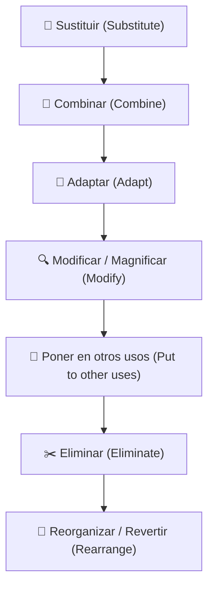
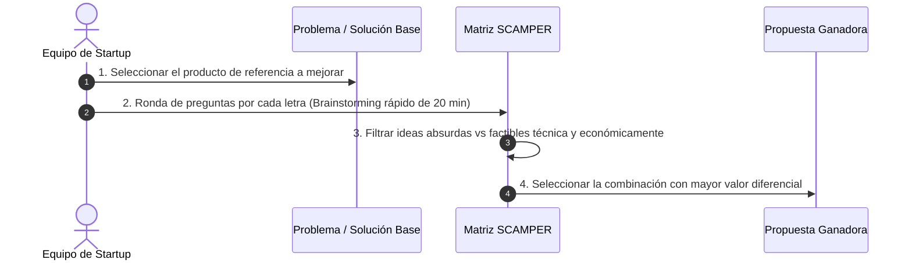

# ⚡ Técnica Creativa SCAMPER: Ideación e Innovación

El método **SCAMPER** (creado por Bob Eberle en 1971 a partir de las ideas de Alex Osborn) es una técnica de **pensamiento lateral y creatividad guiada** diseñada para transformar un producto, servicio o software existente a través de 7 disparadores de cambio deliberados.

> [!TIP] Principio Fundamental
> Las ideas innovadoras rara vez nacen de la nada absoluta. Casi todas las innovaciones surgen de **modificar, recombinar o eliminar elementos** de soluciones que ya existen en el mundo real.

---

## 1. El Acrónimo SCAMPER Explicado

---

## 2. Matriz de Aplicación en Software e Informática

A continuación se detalla cómo se aplica cada letra en proyectos de tecnología:

| Letra | Pregunta Disparadora | Enfoque de Pensamiento | Ejemplo Tecnológico Real |
| :---: | :--- | :--- | :--- |
| **S** | *¿Qué componente, proceso o regla puedo sustituir?* | Cambiar servidores físicos por la nube; cambiar contraseñas por biometría; cambiar bases de datos SQL por grafos. | **Supabase / Firebase**: Sustituir el backend manual tradicional por Backend-as-a-Service instantáneo. |
| **C** | *¿Qué pasaría si combinamos dos funciones o servicios distintos?* | Unir dos herramientas que el usuario usa por separado para evitar cambiar de contexto. | **Notion**: Combinar bloc de notas Markdown con base de datos relacional y gestión de proyectos Kanban. |
| **A** | *¿Qué idea de otra industria o contexto podemos adaptar aquí?* | Tomar conceptos de los videojuegos (gamificación), de la logística de almacenes, o de redes sociales. | **Duolingo**: Adaptar las mecánicas de vidas, rachas y niveles de los videojuegos RPG al aprendizaje de idiomas. |
| **M** | *¿Qué puedo agrandar, hacer más rápido o minimizar al extremo?* | Microservicios, nano-pagos, compresión de video, formatos ultracortos. | **TikTok / Reels**: Minimizar la duración del video de YouTube (de 15 minutos a 15-60 segundos verticales). |
| **P** | *¿Cómo puede usarse esta tecnología para un público o fin totalmente diferente?* | Repensar una herramienta interna como un producto comercial o cambiar el segmento de clientes. | **Slack**: Nació como el chat interno de un videojuego fallido (*Glitch*) y se reconvirtió en el estándar de mensajería empresarial. |
| **E** | *¿Qué paso, interfaz, intermediario o fricción podemos quitar?* | Principio de minimalismo: eliminar la burocracia, clics innecesarios o hardware caro. | **Uber**: Eliminar el intermediario de la centralita telefónica y la fricción de pagar con efectivo en mano. |
| **R** | *¿Qué pasa si invertimos el orden cronológico o el modelo de cobro?* | Invertir el flujo: pagar después de usar, o que el usuario sea el creador del contenido. | **Modelo Freemium / Spotify**: En vez de pagar primero para escuchar el disco (CD), escucha gratis primero y paga suscripción si quieres quitar anuncios. |

---

## 3. Dinámica Práctica de Aplicación en Equipos de Startup

En los talleres de la UNT (Guía de Práctica 04), la técnica se ejecuta en 4 fases rápidas:

---

> [!NOTE] Relación con la Evaluación de Unidad I
> En el examen de la UNT, se solicita a los alumnos aplicar explícitamente una matriz SCAMPER sobre su idea de negocio inicial para justificar por qué su solución es **sustancialmente superior** a los competidores del mercado local.

---
**Fuentes y Referencias:**
* 📄 UNT: *13640 [Semana-04] Innovación y Emprendimiento - Sesión 04: Scrum, Identificación de Ideas y Elevator Pitch.pdf*.
* 📄 UNT: *2. ESO-Taller_creatividad_e_innovacion.pdf*.
* 📚 Eberle, Bob — *Scamper: Games for Imagination Development* (1971).
* 🔗 Relacionado con: [[creatividad-e-innovacion|Creatividad e Innovación]] | [[elevator-pitch|Elevator Pitch]] | [[fase-definir-pov-y-hmw|Fase Definir (POV y HMW)]]
