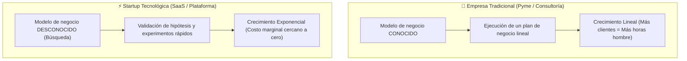
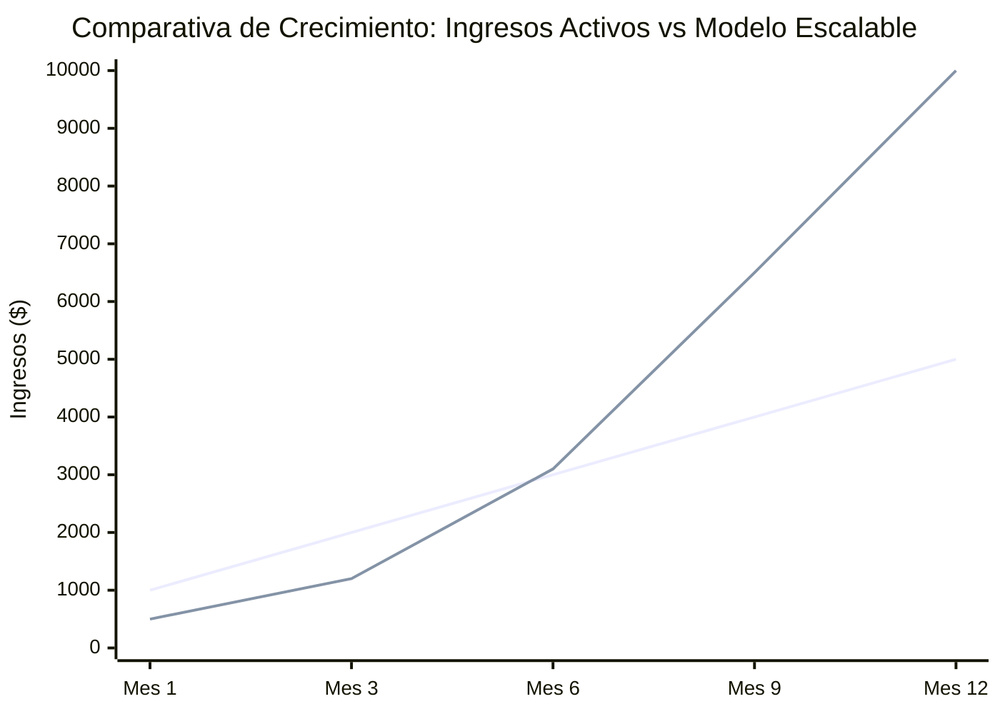

# 🚀 Perfiles Emprendedores, Startups y Lógica de Ingresos

En el ámbito de la ingeniería informática, emprender no es simplemente "abrir un negocio de venta de computadoras o consultoría". Implica estructurar organizaciones ágiles capaces de escalar exponencialmente mediante código y automatización.

---

## 1. ¿Qué es una Startup de Base Tecnológica?

> [!quote] Definición de Steve Blank & Eric Ries (Manual Lean Startup)
> *"Una startup es una organización temporal diseñada para **buscar** un modelo de negocio repetible y escalable, operando bajo condiciones de **extrema incertidumbre**."*

### Diferencia: Empresa Tradicional vs. Startup

---

## 2. Taxonomía de Perfiles Emprendedores

De acuerdo al material de la UNT (Sesión 2), los perfiles se diferencian por su motivación, aversión al riesgo y escala:

| Perfil | Características | Fortaleza Clave | Riesgo a Mitigar | Ejemplo Tecnológico |
| :--- | :--- | :--- | :--- | :--- |
| **Visionario** | Se anticipa al mercado, ve tendencias antes que los demás. | Liderazgo inspirador, atracción de talento y capital. | Desconectarse de la realidad del usuario actual. | Steve Jobs, Elon Musk. |
| **Especialista / Técnico** | Domina a profundidad una tecnología compleja (IA, Ciberseguridad, Compiladores). | Alto rigor técnico y barreras de entrada contra competidores. | Parálisis por análisis: enamorarse de la tecnología y no del problema del cliente. | Cofundador técnico (CTO) de una empresa de Machine Learning. |
| **Oportunista** | Detecta brechas de mercado inmediatas y actúa rápido. | Agilidad de ejecución y olfato comercial. | Falta de foco o crear soluciones superficiales fácilmente imitables. | Crear una plataforma de delivery durante el inicio de la pandemia. |
| **Social** | Busca resolver problemas de salud, educación o pobreza con tecnología. | Alto impacto comunitario y propósito que fideliza usuarios. | Dificultad para lograr la sostenibilidad financiera sin donaciones. | Plataformas EdTech gratuitas para zonas rurales sin internet (MicroUNT). |
| **Intraemprendedor** | Innova dentro de una empresa establecida usando los recursos de esta. | Acceso a presupuesto, infraestructura y clientes consolidados. | Burocracia corporativa que frena la velocidad de iteración. | Los creadores de *Gmail* dentro de Google. |

---

## 3. Lógica de Ingresos: Activos vs. Pasivos y Escalabilidad

Una de las preguntas críticas en las evaluaciones de la UNT es demostrar cómo el modelo de negocio alcanza la **escalabilidad**.

### A. Ingresos Activos (Modelo Lineal)
* **Principio:** Intercambio directo de **tiempo por dinero**.
* **Ejemplo:** Agencia de desarrollo de software a medida. Si tienes 5 clientes necesitas 5 programadores. Si quieres 50 clientes necesitas 50 programadores y más oficinas.
* **Limitación:** El crecimiento de los ingresos está estrictamente limitado por la capacidad operativa humana.

### B. Ingresos Pasivos / Escalables (Costo Marginal Cercano a Cero)
* **Principio:** Construir una solución de software una vez y servir a miles de usuarios simultáneamente.
* **Ejemplo:** Modelo **SaaS (Software as a Service)** como Notion, Figma o Slack. Construir la base de datos y la interfaz cuesta un esfuerzo inicial, pero el cliente número 10,000 cuesta casi lo mismo de atender que el cliente número 1.
* **Mecanismos:** Suscripciones mensuales (MRR), comisiones por transacción (Take Rate), licencias por API.

---

## 4. El Ecosistema de Apoyo en Perú (Startup Perú / ProInnóvate)

Las startups en el entorno académico peruano buscan capital semilla a través de:
* **ProInnóvate (Ministerio de la Producción):** Fondos no reembolsables (*Concurso Startup Perú - Emprendimientos Innovadores*) para prototipos validados con tracción inicial.
* **Incubadoras Universitarias:** Espacios de mentoría, networking y asesoría legal para proteger la propiedad intelectual del software.

---

> [!IMPORTANT] Clave de Examen: Justificación del Equipo
> En las fichas grupales de la asignatura, el equipo ideal de una startup de software debe balancear:
> 1. Un rol de producto/negocio (**Hacker + Hustler + Hipster**).
> 2. Una estrategia clara que pase de servicios iniciales (ingresos activos para fondearse) hacia un producto SaaS automatizado (ingresos escalables).

---
**Fuentes y Referencias:**
* 📄 UNT: *13640 [Semana-02] Innovación y Emprendimiento - Clase.pdf*.
* 📄 UNT: *Anexo_1.1_(Guia_Startup).pdf* y *Anexo_1.2_(Startup_Peru_Ejemplos).pdf*.
* 📚 Ries, Eric — *The Lean Startup* (2011).
* 🔗 Relacionado con: [[creatividad-e-innovacion|Creatividad e Innovación]] | [[business-model-canvas-vs-lean-canvas|Modelos Canvas]] | [[scrum-para-startups|Scrum para Startups]]
