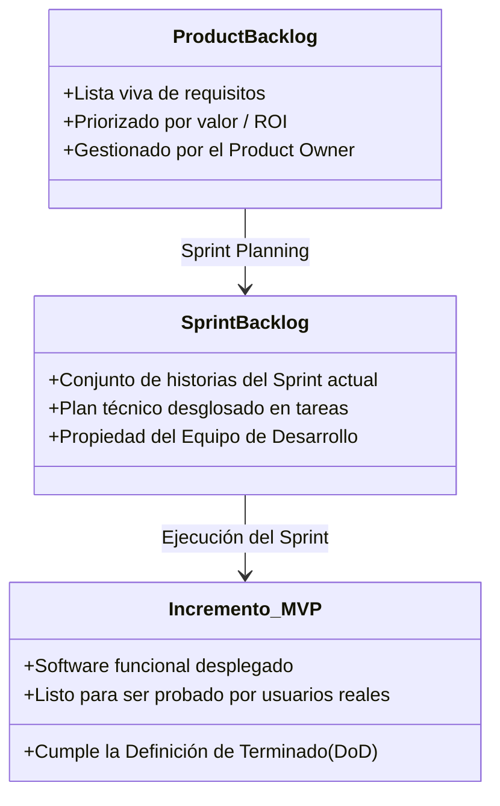

# 🏃 Scrum para Startups: Gestión Ágil de Proyectos Tecnológicos

En una startup, el mayor peligro no es que el software tenga bugs, sino **construir con meses de trabajo algo que nadie quiere usar**. Por ello, el marco de trabajo **Scrum** permite a los equipos de ingeniería informática iterar a alta velocidad y validar hipótesis de negocio en ciclos cortos.

---

## 1. Los Tres Roles Fundamentales en el Equipo de Startup

En la dinámica del curso UNT (Práctica 04 y Examen I Unidad), cada grupo de 3-4 estudiantes debe asumir explícitamente estos roles:

| Rol | Responsabilidad en la Startup | Enfoque de Evaluación |
| :--- | :--- | :--- |
| **Product Owner (PO)** | **Voz del cliente y del negocio.** Maximiza el valor del producto. Define y prioriza los ítems del Product Backlog según la retroalimentación de los usuarios. | Define *QUÉ* se construye y *POR QUÉ*. Evita que el equipo desarrolle funciones innecesarias. |
| **Scrum Master (SM)** | **Facilitador y guardián del proceso ágil.** Remueve bloqueos e impedimentos técnicos u organizacionales. Ayuda a mantener el ritmo de trabajo sin sobrecargar al equipo. | Garantiza *CÓMO* colabora el equipo eficientemente. Modera las reuniones diarias y la retrospectiva. |
| **Equipo de Desarrollo (Developers)** | **Constructores de la solución.** Profesionales multidisciplinarios (Arquitectura de software, Frontend, Backend, UI/UX, Base de Datos). Son autogestionados. | Deciden *CÓMO SE IMPLEMENTA TÉCNICAMENTE* y estiman el esfuerzo de cada tarea. |

---

## 2. Los Artefactos de Scrum en Contexto de Innovación

1. **Product Backlog:** Lista dinámica de todas las características, mejoras y correcciones que la startup podría desarrollar, escritas en formato de **Historia de Usuario**:
   > *"Como [tipo de usuario], quiero [acción/funcionalidad] para [beneficio/propósito]."*
2. **Sprint Backlog:** El subconjunto de tareas que el equipo se compromete a entregar en el sprint en curso.
3. **Incremento (MVP - Producto Mínimo Viable):** Una versión funcional del software que se puede probar con usuarios reales para medir métricas clave (Lean Startup).

---

## 3. Los Eventos (Ceremonias) Ágiles

En startups se recomiendan sprints cortos de **1 a 2 semanas** para minimizar el riesgo financiero:

* **Sprint Planning (Planificación):** El PO presenta las prioridades y el equipo define el objetivo del sprint (*Sprint Goal*).
* **Daily Scrum (Reunión diaria de 15 min):** Cada miembro responde:
  1. *¿Qué logré ayer para apoyar el objetivo del sprint?*
  2. *¿Qué haré hoy?*
  3. *¿Tengo algún impedimento que me bloquee?*
* **Sprint Review (Revisión con stakeholders):** Demostración en vivo del software funcionando (no diapositivas, sino producto real).
* **Sprint Retrospective (Retrospectiva):** Espacio interno del equipo para reflexionar: *¿Qué funcionó bien? ¿Qué falló? ¿Qué cambiaremos el próximo sprint?*

---

> [!IMPORTANT] Integración: Scrum + Lean Startup
> En el ecosistema tecnológico, Scrum es el motor de ingeniería que ejecuta el bucle de **Lean Startup**:
> $$\text{Idea} \xrightarrow{\text{Sprint}} \text{Construir (Código)} \xrightarrow{\text{Métricas}} \text{Medir (Datos)} \xrightarrow{\text{Retro/Review}} \text{Aprender (Decisión de Pivotar)}$$

---
**Fuentes y Referencias:**
* 📄 UNT: *13640 [Semana-04] Innovación y Emprendimiento - Sesión 04: Scrum, Identificación de Ideas y Elevator Pitch.pdf*.
* 📄 UNT: *Guia_Practica_04_Seccion.docx (1).pdf*.
* 📚 Schwaber, K. & Sutherland, J. — *The Scrum Guide* (2020).
* 🔗 Relacionado con: [[perfiles-emprendedores-y-startups|Perfiles Emprendedores]] | [[elevator-pitch|Elevator Pitch]] | [[design-thinking-metodologia|Design Thinking]]
