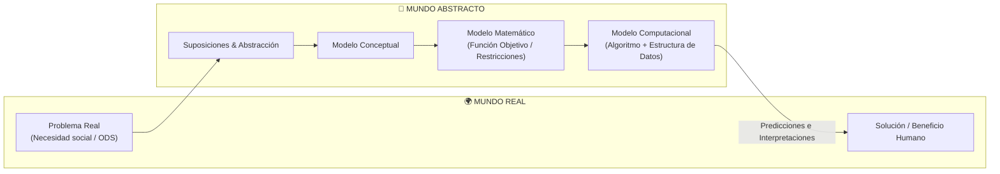
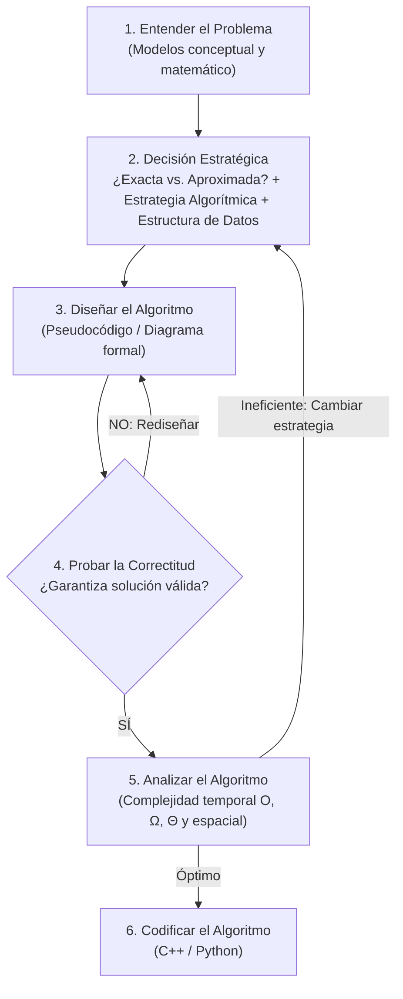

# 🧠 Resumen Semana 1: Ciencia, Modelado Abstracto y Pipeline de Solución Algorítmica

> **Asignatura:** Estrategias Algorítmicas (2026-I) | **Docente:** Dr. José A. Rodríguez Melquiades  
> **Fuente Original:** [[fuentes/estrategias/SEMANA 1/Teoria 1.pdf]]

---

## 🎯 Tesis Central de la Clase
El diseño de algoritmos no es un acto aislado de programación, sino una **disciplina científica y metodológica**. Para resolver un problema del mundo real, un informático debe transformarlo en un **modelo matemático abstracto**, seleccionar rigurosamente entre una **estrategia exacta o aproximada**, demostrar matemáticamente su **correctitud** y analizar su **complejidad** antes de escribir una sola línea de código.

---

## 🔬 1. El Puente entre el Mundo Real y el Mundo Abstracto

- **Ciencia:** Conjunto de conocimientos sistemáticos y comprobables fundamentados en la **observación** y la **experimentación**.
- **Ciencia de la Computación:** Se divide en tres ramas fundamentales:
  1. **Diseño y Análisis de Algoritmos** *(foco central de este curso)*.
  2. **Arquitectura de Computadores**.
  3. **Informática Teórica**.

---

## ⚙️ 2. El Pipeline de 6 Pasos para Solucionar Problemas Computacionales

El Dr. Rodríguez Melquiades enfatiza este flujo estricto como estándar para las evaluaciones y proyectos:

1. **Entender el problema:** Delimitar entradas, salidas, restricciones y formular el modelo matemático ($f(x)$, restricciones $g(x) \le 0$).
2. **Decisión Metodológica:**
   - ¿El problema es de la **[[wiki/conceptos/complejidad-p-vs-np|Clase P o Clase NP]]**?
   - ¿Buscamos una **solución exacta** (100% óptima) o **aproximada** (heurística rápida)?
   - Selección de la estructura de datos adecuada (Grafos, Árboles, Tablas Hash, Matrices).
3. **Diseño del algoritmo:** Plantear la lógica estructural basada en las 7 grandes estrategias.
4. **Demostración de Correctitud:** Pruebas por inducción matemática, invariantes de bucle o contradicción.
5. **Análisis de Eficiencia:** Notación asintótica en el peor, mejor y caso promedio.
6. **Codificación:** Implementación libre de errores y optimizada a bajo nivel.

---

## 📊 3. Taxonomía de las 7 Grandes Estrategias Algorítmicas

| Estrategia | Tipo de Enfoque | Clase de Problema | Caso Típico |
| :--- | :--- | :--- | :--- |
| **[[wiki/conceptos/branch-and-bound\|Branch and Bound (Ramificación y Poda)]]** | Exacto (Optimización) | NP-Hard | Problema del Viajante (TSP), Mochila 0/1 |
| **[[wiki/conceptos/heuristica-y-metaheuristica\|Heurísticas y Metaheurísticas]]** | Aproximado | NP-Hard | Algoritmos Genéticos, Recocido Simulado |
| **[[wiki/conceptos/fuerza-bruta\|Fuerza Bruta]]** | Exacto (Exhaustivo) | General / NP | Búsqueda exhaustiva $O(2^n)$, $O(n!)$ |
| **[[wiki/conceptos/algoritmos-voraces\|Algoritmos Voraces (Greedy)]]** | Exacto / Aproximado | P / NP | Kruskal, Prim, Huffman |
| **[[wiki/conceptos/dividir-para-vencer\|Dividir para Vencer]]** | Exacto (Recursivo) | Clase P | MergeSort, Búsqueda Binaria |
| **[[wiki/conceptos/programacion-dinamica\|Programación Dinámica]]** | Exacto (Memorización) | Clase P / Pseudo-P | Bellman, Mochila DP, Floyd-Warshall |
| **[[wiki/conceptos/backtracking\|Backtracking (Vuelta Atrás)]]** | Exacto (Restricciones) | NP-Hard | N-Reinas, Sudoku, Coloreo de Grafos |

---

## 🧪 4. Método Científico, Investigación y Transferencia Tecnológica

Para el **Proyecto de Investigación Formativa** del curso (que vale el **25% de la Unidad 3**):

1. **Diseño de Investigación:**
   - **Cuantitativo Explicativo:** Medir tiempos de ejecución (variable dependiente) vs. tamaño de entrada $N$ y tipo de estrategia (variable independiente) mediante experimentos controlados.
2. **Criterios de Validez:**
   - **Falsación (Popper):** Contrastar hipótesis nulas de rendimiento mediante pruebas estadísticas rigurosas en R / Python.
3. **Transferencia Tecnológica (CONCYTEC):**
   - El conocimiento generado debe apuntar a la solución de problemas reales (ODS: industria, infraestructura, optimización de recursos) con potencial de publicación científica y licenciamiento.

---

## 📝 5. Preguntas Clave Tipo Examen (Dr. Rodríguez Melquiades)

> [!TIP] Preguntas Clave para Examen de Unidad I
> 1. **¿Por qué un problema de optimización requiere primero un modelo matemático antes de elegir la estrategia algorítmica?**  
>    *Respuesta:* Porque la formulación de la función objetivo y las restricciones determina si el espacio de soluciones es convexo, discreto, continuo o combinatorio (P vs NP-Hard), lo cual condiciona si es factible usar un método exacto (Branch and Bound / DP) o aproximado (Metaheurística).
> 2. **¿Cuál es la diferencia metodológica entre probar la correctitud y analizar la eficiencia de un algoritmo?**  
>    *Respuesta:* La **correctitud** demuestra matemáticamente que el algoritmo siempre termina y devuelve la respuesta correcta para *toda* entrada válida. La **eficiencia** cuantifica el consumo asintótico de recursos computacionales (tiempo $O(f(n))$ y memoria) a medida que $n \to \infty$.

---

## 🔗 Páginas Relacionadas
- **Hub del Curso**: [[wiki/cursos/estrategias-algoritmicas|Estrategias Algorítmicas 2026-I]]
- **Síntesis Maestra**: [[wiki/synthesis/mapa-estrategias-algoritmicas|Mapa de Estrategias Algorítmicas]]
- **Siguiente Tema**: Semana 2 (Optimización y Asignación de Tareas)
