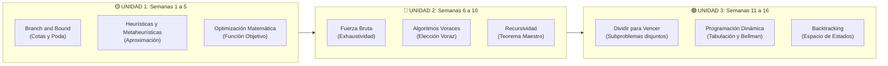

# ♟️ Mapa Maestro: Taxonomía de Estrategias Algorítmicas

> [!IMPORTANT] Clave para el Éxito en Estrategias Algorítmicas (2026-I)
> Para dominar los exámenes del **Dr. José A. Rodriguez Melquiades**, ante cualquier problema debes responder inmediatamente 3 preguntas fundamentales:
> 1. **¿A qué clase de complejidad pertenece el problema?** (Fácil / Clase P vs. Difícil / Clase NP-Hard).
> 2. **¿Qué tipo de solución requiere?** (Método Exacto / Óptimo Global vs. Método Aproximado / Heurístico).
> 3. **¿Cuál es la estrategia algorítmica óptima y su cota de complejidad?** ($O(n \log n)$, $O(n^k)$, $O(2^n)$, $O(n!)$).

---

## 📊 Matriz Taxonómica Completa

| Clase de Problema | Naturaleza de Solución | Estrategia Algorítmica | Mecanismo Central | Complejidad Típica | Garantía Óptima |
| :--- | :--- | :--- | :--- | :--- | :---: |
| **Fáciles (Clase P)** | **Exacto** | **[[wiki/conceptos/dividir-para-vencer\|Dividir para Vencer]]** | Descomposición en subproblemas disjuntos independientes. | $O(n \log n)$ | ✅ 100% |
| **Fáciles (Clase P)** | **Exacto** | **[[wiki/conceptos/programacion-dinamica\|Programación Dinámica]]** | Subproblemas superpuestos + Memorización / Tabulación. | $O(n^2)$ a $O(n^3)$ | ✅ 100% |
| **Fáciles / Casos Especiales** | **Exacto** | **[[wiki/conceptos/algoritmos-voraces\|Algoritmos Voraces (Greedy)]]** | Elección localmente óptima con subestructura óptima (ej. Kruskal, Huffman). | $O(n \log n)$ | ✅ 100% *(solo si cumple propiedad voraz)* |
| **Difíciles (Clase NP)** | **Exacto** | **[[wiki/conceptos/fuerza-bruta\|Fuerza Bruta (Exhaustiva)]]** | Generación y prueba de todo el espacio de soluciones. | $O(2^n)$ o $O(n!)$ | ✅ 100% |
| **Difíciles (Clase NP)** | **Exacto** | **[[wiki/conceptos/backtracking\|Backtracking (Vuelta Atrás)]]** | Árbol DFS + poda cuando se violan restricciones. | Exponencial acotado | ✅ 100% |
| **Difíciles (Clase NP)** | **Exacto (Optimización)** | **[[wiki/conceptos/branch-and-bound\|Branch and Bound (Ramificación y Poda)]]** | Árbol BFS / Best-First + **cotas matemáticas (Bounds)** para podar ramas subóptimas. | Exponencial optimizado | ✅ 100% |
| **Difíciles (Clase NP)** | **Aproximado** | **[[wiki/conceptos/heuristica-y-metaheuristica\|Heurísticas]]** | Reglas prácticas de sentido común / atajos computacionales. | Polinómico rápido | ❌ Solución "Buena" |
| **Difíciles (Clase NP)** | **Aproximado** | **[[wiki/conceptos/heuristica-y-metaheuristica\|Metaheurísticas]]** | Algoritmos Genéticos, Recocido Simulado, Búsqueda Tabú, Colonia de Hormigas. | Controlado por iteraciones | ❌ Óptimo Local / Cuasi-Global |

---

## 🎯 Plan de Estudio Estratégico por Unidades (Sílabo 2026-I)

---

## 🔗 Páginas de Conceptos Vinculadas

- [[wiki/conceptos/branch-and-bound|Branch and Bound (Ramificación y Poda)]]
- [[wiki/conceptos/heuristica-y-metaheuristica|Heurísticas y Metaheurísticas]]
- [[wiki/conceptos/programacion-dinamica|Programación Dinámica]]
- [[wiki/conceptos/algoritmos-voraces|Algoritmos Voraces]]
- [[wiki/conceptos/backtracking|Backtracking]]
- [[wiki/conceptos/dividir-para-vencer|Dividir para Vencer]]
- [[wiki/conceptos/fuerza-bruta|Fuerza Bruta]]
- [[wiki/conceptos/complejidad-p-vs-np|Clase P vs. Clase NP]]
- Hub Principal: [[wiki/cursos/estrategias-algoritmicas|Hub de Estrategias Algorítmicas 2026-I]]
